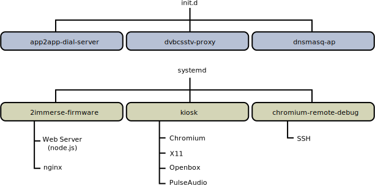
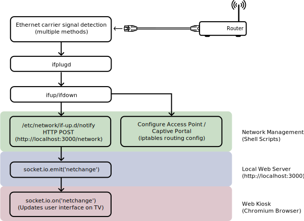

# 2-IMMERSE TV Emulator Firmware Builder

<em>This project was originally developed as part of the <a href="https://2immerse.eu/">2-IMMERSE</a> project, co-funded by the European Commission’s <a hef="http://ec.europa.eu/programmes/horizon2020/">Horizon 2020</a> Research Programme</em>

# Introduction

This repository contains build scripts for the 2-IMMERSE HbbTV emulator firmware. The firmware is a software bundle that emulates a subset of HbbTV2.0 features. It helps users configure and launch multi-screen experiences. It provides a dedicated wireless access point for tablets and phones to use. This can offer an improved network connection compared to the venue's WiFi hotspot due to the likely vicinity of the mobile devices to the TV. It also includes a captive portal for remote configuration allowing keyboard-less operation.

# Directory structure:

* `2immerse-firmware/`
  Source code and build scripts for 2-IMMERSE TV emulator
* `debian/`
  Build scripts for Debian Linux-based firmware
* `docs/`
  Images referenced by README.md

# Firmware Overview

The firmware is composed of two components:

- Customised Debian-based Linux distro
- Debian package for all architectures (x86, arm etc.) - 2immerse-firmware_1.1-1_all.pkg

The firmware is built as a hybrid .ISO that can be written to a USB drive or DVD and booted from. When the .ISO boots it presents the user with an installation menu. For the 2-IMMERSE project, the firmware has been tested on an Intel NUC model NUC7i3BNK with 4GB of RAM and a 128GB SSD. If you are using an Intel NUC device, please see the section below on flashing your NUC's BIOS/HDMI system firmware before proceeding with installation. The 2-IMMERSE firmware has also been installed into a VirtualBox virtual machine. It includes an alternative set of scripts to emulate/mock a WiFi network inside the virtual machine. Finally, the Debian package has been tested successfully on RaspberryPi 3 hardware.

# Features

The 2-Immerse TV emulator firmware consists of the following high-level components:

- Debian Linux Operating System
- HbbTV2.0 emulator services (App2App server, DVB-CSS server and DIAL server)
- On-boarding system
- Administration Portal
- Network connectivity management layer
- WiFi Router/gateway and access point
- Captive portal
- Web Kiosk (Chromium H/W accelerated)
- SSH tunnel service for remote debugging of Chromium web pages
- Web server to host the firmware's web application

# Building

The 2-IMMERSE TV emulator firmware is built within a Docker container.
The host OS (such as Mac OS X or Linux) will need the following tools installed:

- Docker
- GNU make 3.81 (or later)

To start the build, run:

```
make PRIVATE_KEY_FILENAME=~/.ssh/irt_rsa all
```

The build clones source files from the 2-IMMERSE client-api repository, hence why it is necessary to provide a git deploy key. Substitute ~/.ssh/irt_rsa with a deploy key or your private GitHub key.

The resulting .ISO file is written to:

```
./build/live-image-amd64.hybrid.iso
```

## Installing the ISO (Instructions for Mac OSX)

The .ISO can be copied to a USB disk or burned to a DVD. To copy to an USB disk, you must find out the name of the disk. Run the following command before and after inserting the USB disk to ascertain its name e.g. /dev/disk2

```
df -h 
```

Substitute /dev/disk2 referenced in the following commands with the name of your USB disk. Make sure it's the name of the disk, not the name of an existing partition on the disk such as /dev/disk2s2.
*NOTE: Take great care to use the correct device name to ensure you don't destroy your system*

Firstly umount the disk: 

```
diskutil umount /dev/disk2
```

Then block copy the .ISO as follows, observing the 'r' inserted before the disk name. Note, this command must be run with root privileges.

```
sudo dd if=build/custom.iso of=/dev/rdisk2 bs=1m
```

To determine progress of the copy, press CTRL+T. On completion, eject the disk and remove it:

```
diskutil eject /dev/disk2
```

Boot from the USB stick (usually requires you to press F2 or F10 to enter system boot preferences on your device and select the USB disk manually) and select the text-based install from the Advanced Install sub-menu.

During installation, choose 'Cancel' when the installer tries to configure the IP address via DHCP and skip configuration of networking at the next prompt.

Also, when prompted about partitioning, select 'Guided - use entire disk'. This ensures you get to choose the correct hard disk (/dev/sda). If you don't do this, the installer may try to partition the USB stick containing the installer!

# Debugging tips and development tools

1. You can ssh directly into the device if you know its IP address.
  - Username: `kiosk`
  - Password: `kiosk`
  - Note: kiosk is a member of the ‘sudo’ group
2. You can use mDNS to discover the device's ip address. The device is named '2immerse.local'.
3. You can use a computer (on the same network) running Chrome/Chromium to remotely debug web pages by browsing to:
  - `http://tv_emulator_ip_addr:9223`
4. You can remotely force the firmware to visit any web address you like by typing the following into the console panel of the remote debugging session.
  - `location.href = "http(s)://requested_domain_or_ip"`
5. If you attach a keyboard, you can press `CTRL+ALT+FUNCTION1-6` to switch between gettys. X11 runs on tty2 

# Service Overview

The diagram below gives an overview of the services running on the TV emulator. Each box highlights a system service started on boot, together with its main dependencies.



The firmware emulates a subset of the HbbTV2.0 features. It runs a DIAL service (Discovery and Launch) and an ‘app2app’ server providing a local communication mechanism between devices over web sockets connections. 

The firmware also runs a pydvbcss proxy server to allow the Chromium web browser to communicate via DVB protocols with companion devices for the purpose of synchronisation. For more information about the pydvbcss functionality, see: [https://github.com/bbc/pydvbcss].

## Administration Portal

On boot, the firmware starts a service that displays a locally served webpage and checks for an Internet connection. If an Internet connection is detected, it proceeds to load a welcome page (normally the unified launcher webapp) from the CDN via a URL that can be configured and parameterised using the firmware’s admin panel. This allows developers to repoint the firmware at production, test and edge server environments. It also allows developers to specify an arbitrary URL for the firmware to load. 

The firmware serves up an admin page at the following URL:
 
`http://your-device-ip-addr:3000/admin`

The URL of the main web page displayed by the firmware is:

`http://your-device-ip-addr:3000/device`

Admin settings are stored in a file on the device and will persist between reboots. The is located here: 

`/var/lib/2immerse-admin-config.json`

It is safe to delete this file manually; the firmware will regenerate it with default settings the next time it is restarted.

In addition to configuring server environment and the launcher webapp, the admin portal exposes settings to reconfigure the access point. This includes DHCP range, IPv4 Gateway Address, CIDR Mask and DHCP lease time. There is also a setting to configure the WiFi channel used by the NUC's wireless interface and a value to use as the ESSID name / DIAL friendly name.

Pressing Update will reconfigure the network configuration of the NUC. This operation may take several minutes and it may take a while for the UI to report that it has reconnected to the network.

## Network Connection

There are two ways to connect a 2-IMMERSE TV emulator device to the Internet:

1.	Via a wired Ethernet cable
2.	By configuring a WiFi connection

If the device doesn’t have an internet connection via ethernet, it operates as a captive portal. Use a phone, tablet or PC to connect to the captive portal (using access point mode credentials - see 'WiFi Password' below). You’ll be served a captive portal page asking you to configure the device's WiFi connection for internet access. The captive portal can be used to re-configure the internet connection at any time. If you have configured the device to use a wireless connection and subsequently plug in an ethernet cable, the ethernet connection will be used in preference and the NUC will change to access point mode.

The default network/route of the wired interface has a lower routing metric than that of the WiFi interface so it’s chosen in preference by the kernel when routing requests to the Internet. This is because the wired connection is more likely to deliver a higher quality of service than a WiFi connection. Using an Ethernet cable is also the easiest way to setup the device because there are fewer steps for the user to perform.

When using the Ethernet cable to connect to the venue’s router, the TV emulator device will create its own WiFi hotspot offering phones and tablets a wireless Internet connection that’s potentially(*) better than the venue’s existing hotspot. 

(* The Intel Wireless-AC 8265 adapter used by the Intel NUC doesn't support 802.11ac in access point mode, however 802.11n is supported but only at 2.4GHz frequencies. 802.11n supports two channel widths; 20Mhz and 40MHz. Channel bonding is used to achieve 40Mhz widths but bonding is not recommended at 2.4GHz frequencies. This limits the maximum bandwidth between companion devices and the NUC to be about 130Mb/s. For more information about channel widths, see: [https://support.metageek.com/hc/en-us/articles/204490510-40-MHz-Channels]).

If it’s not possible to connect an Ethernet cable, the device can be configured to connect to the venue’s WiFi. In this mode, the device’s own WiFi hotspot doesn’t offer companion devices a quality of service advantage. So instead, it is used to serve a captive portal page that presents users with a choice of locally discovered venue WiFi hotspots to use. A companion device can use this page to select which of the venue’s WiFi hotspots the TV emulator device should connect to.

This process involves temporarily connecting a companion device to the TV emulator device’s WiFi hotspot / captive portal. The user can repeat the WiFi configuration steps for the TV emulator device at any time as long as there isn’t an Ethernet cable plugged in. This might be required if the user changes the venue’s WiFi password.

## WiFi Password

The default WPA2 key for the access point / captive portal is:

ESSID: `2immerse-XXXX`
WPA2 key: `twoimmerse`

(where XXXX is a code derived from the MAC address of the ethernet network interface).

## Network connectivity management layer

The firmware is responsible for monitoring changes in network connectivity resulting from:

- Ethernet cable being inserted or removed
- User configuring/re-configuring WiFi credentials
- The venue’s router password being changed or becoming inaccessible

Ethernet cable pulls are detected using the ‘ifplugd’ system daemon. It uses the presence (or absence) of a carrier signal to determine whether there is currently a wired connection to the venue’s router. When changes in connectivity are detected, the daemon will bring the corresponding Ethernet interface up or down which in turn executes custom network management hooks. The network connection signalling scheme is summarised in the diagram below:



The hooks are simple shell scripts that change the behaviour of the firmware based on whether there is a wired or wireless connection available. There are two scripts that are executed, represented in the diagram by the two green boxes.

The first script is used to notify the user of the network connection status in the user interface. It makes an HTTP POST request to the local web server running on the TV emulator device to inform it of the up/down phase of each network interface. The web server communicates this information to the web kiosk (Chromium browser) over a web socket connection, resulting in a status notification to the user.

The second script is used to switch the behaviour of the TV emulator’s access point from a general-purpose router to a captive portal and vice versa.

## Integrated WiFi router/gateway and access point

Switching between router and captive portal modes of operation is achieved by changing the network routing rules (using ‘iptables’). When operating as a router, all incoming packets from the network interface associated with the access point are redirected to the wired interface and DNS requests are serviced by the operating system’s DNS resolver on port 53. When configured as a captive portal, all incoming TCP requests on port 80 are routed to the local web server on port 3000 which serves a captive portal page and all DNS requests on port 53 are redirected to a ‘dnsmasq-ap’ service running locally on port 5353. The ‘dnsmasq-ap’ service resolves all domain names to the IP address/port of the local web server. 

The diagram below shows the wired interface’s if-*.d scripts switching between router and captive portal configurations. It also shows the three network adapters configured on the TV emulator device; wlpap0 and wlp58s0 share the same physical WiFi hardware.


The WiFi interface wlp58s0 can be in one of two states. It can be configured with valid WiFi credentials or un-configured. When un-configured, the interface must still be brought up by setting its configuration to ‘manual’ in order to be able to scan for networks. When connecting to a venue’s WiFi, wlp58s0 uses the ‘dhcp’ setting to automatically lease an IP address.

WiFi credentials are generated using wpa_passphrase and managed by wpa_supplicant. The WiFi interface is set back to ‘manual’ if the submitted credentials are incorrect. The firmware stores the previously configured WPA2 credentials in a configuration file which persists between reboots. 

The firmware creates a new virtual interface for the access point (wlpap0) and the ‘hostapd’ daemon configures the WiFi driver to make the interface behave as an access point. The firmware also assigns it a static IP address because the router needs to have an IP address on the same subnet as IP addresses allocated by the router's DHCP server. To route packets between wlpap0 and the wired Ethernet interface it’s necessary to enable packet forwarding in the kernel.

The firmware derives a unique-ish ESSID name for its WiFi hotspot based on the last four digits of the MAC address of the wired network interface (en0). Alternatively, the ESSID can be configured via the firmware's administation portal.

## Captive Portal

The captive portal provides a way to configure the WiFi connection of the TV emulator without the need to plug a keyboard in. Almost any modern phone, tablet or computer can be used to enter the WiFi credentials of the preferred access point on behalf of the TV emulator via its captive portal page. This doesn’t require any special software to be installed on those devices because it leverages standard functionality built into their operating systems.

WiFi in hotels and airports usually implement a captive portal web page that asks the user to sign in and/or accept terms and conditions in order to gain WiFi access. In contrast, the captive portal web page hosted by the TV emulator presents the user with a choice of WiFi access points with which to configure the TV emulator’s WiFi. Note that this choice is currently limited to available WPA2-only access points.

An alternative approach is to have the user connect to the TV emulator’s WiFi hotspot and type in the URL of the WiFi configuration page into their web browser i.e.

```
http://tv-emulator-device-ip-addr
```

### Captive Portal Components

The captive portal is built using standard Debian Linux components: 
 
1.	hostapd – a daemon that turns the WiFi adapter into an access point
2.	iptables – for redirecting packets to the captive portal page
3.	DNS resolver – for resolving DNS requests to the local web server
4.	DHCP server – for leasing an IP address to each companion device
5.	Web server – for serving the captive portal web page

‘dnsmasq’ is a combined DNS/DHCP server which is easy to configure and use. When a computer connects to an access point, it receives several pieces of information from dnsmasq: 
 
1.	An IP address and subnet mask (e.g. 192.168.10.5/24)
2.	A broadcast IP address for the subnet (e.g. 192.168.10.255) 
3.	IP address of the gateway/router (on the same subnet e.g. 192.168.10.1) 
4.	The IP addresses of one or more DNS servers
  
After receiving this information, the connecting computer checks to see if there is a captive portal associated with the access point by requesting a URL. For example, on iOS devices the requested URL is http://www.apple.com/library/test/success.html. 
 
The captive portal detection algorithm can be summarised as follows: 
 
•	GET/POST a URL (varies between OS’s e.g. http://www.apple.com/library/test/success.html) 
•	If ([success.html] == expected content) => It’s an open Internet connection 
•	If ([success.html] != expected content) => It’s a captive portal 
•	If (http status code != 200 (i.e. success)) => There’s no network 
 
### Captive Portal Detection Request

The URL request starts with a DNS request to one of the DNS servers advertised by the access point. Access points that implement a captive portal host their own DNS server which resolves all server names (e.g. apple.com) to the gateway's IP address where a webserver is running. A complementary approach is to resolve the DNS request as normal, but redirect all TCP traffic on port 80 to the webserver. This latter approach assumes the DNS server has an Internet connection and can forward on the DNS request. Captive portals effectively implement a "man-in-the-middle" attack.

The computer then makes a HTTP request to the resolved IP address to fetch the content. (For further information, see <http://blog.erratasec.com/2010/09/apples-secret-wispr-request.html#.WUbAxvryuAw>). 
 
Each operating system uses a different URL to test for the presence of a Captive Portal, see: <https://serverfault.com/questions/679393/captive-portal-popups-the-definitive-guide>. All URLS are redirected regardless, so this is only relevant if the captive portal wants to infer the type of platform making the connection request. 
 
The captive portal webserver must always respond with a HTTP redirect (302). This informs the connecting computer that this is a captive portal and the OS will open a captive portal window showing the response, which is typically a web page with a login form. If there isn't a redirect, the user won't be shown a captive portal window. See this article for further information: 
<https://www.reddit.com/r/darknetplan/comments/ou7jj/quick_and_dirty_captive_portal_with_dnsmasq/>

### Captive Portal Detection on iOS devices
 
iOS expects the redirect URL to contain a domain name, not an IP address. If the redirect URL is http://192.168.10.1 as opposed to http://myhotspot.localnet it assumes a home network, not a captive portal. This requires careful configuration of the webserver and DNS server hosted by the access point.  
 
On apple devices such as iOS, the computer may also expect to be redirected to an XML file instead containing a <WISPAccessGatewayParam/> XML element. This is a standard referred to as 'CaptiveNetworkSupport'. The XML element contains the actual redirect URL, but also contains other information. iOS devices will only show the captive portal window if they receive a Captive Network Support XML file. 

### Captive Portal Detection on Samsung Devices

Samsung Android devices (S5-S8) require all domain names used for captive portal detection to be resolved to public IP addresses by the DNS server (i.e. not 192.168.10.1). At the time of writing, this includes:

- connectivitycheck.android.com
- connectivitycheck.gstatic.com
- clients3.google.com

This is a well-documented difference between Samsung devices and other devices running Android. Samsung appear to perform an additional check on the type of IP address resolved by the DNS server. Since the TV emulator device might not yet have an internet connection, we can't forward the DNS requests for these domain names to an Internet DNS server to be resolved. Consequently, they need white-listing by the local DNS server so that they are resolved to public-looking IP addresses. Then HTTP packets need to be routed to the local web server at 192.168.10.1 using ‘iptables’ rules.

## Web Kiosk Service

The web kiosk service has four main components:

1. Chromium – The open-source version of Google Chrome
2. Openbox - A lightweight window manager supporting hints to enable Chromium to run full-screen 
3. X11 - The display server 
4. PulseAudio – X11 audio server

The web kiosk runs automatically on boot as a systemd service (kiosk.service). It is run as a non-root user with carefully configured group membership to permit audio and video access. The kiosk server starts after all other services have started and the system is idle. It depends on a ‘getty’ starting to ensure X11 can switch virtual terminals without error. 

### Chromium

The firmware uses a customised version of Chromium that provides hardware accelerated video decoding on Linux. It’s available from the following personal package archive (PPA):

```
  ppa:saiarcot895/chromium-beta
```

See: <https://launchpad.net/~saiarcot895/+archive/ubuntu/chromium-beta>

Chromium is automatically restarted by the kiosk service if it terminates unexpectedly and is deliberately restarted when the network configuration of the TV emulator changes. This is because changes to network state can happen at critical points in time such as during a page load and can leave the user interface in a partially loaded state from which there is no recovery without manual intervention. 

Chromium is run in incognito mode to ensure it returns to a known good state and to prevent unexpected behaviour resulting from content/credential caching.  

To support features such as WebRTC-based video chat, Chromium is run with ‘—disable-web-security’ to stop it prompting the user for permission to use the web camera and microphone.

Chromium is also configured to allow mixed http and https requests using the ‘—allow-running-insecure-content’ option. This permits content on the CDN served via HTTPS to communicate with the local HbbTV2.0 emulation services which are accessed via unencrypted HTTP requests.

Here is the complete command-line invocation of chromium used by the kiosk service:

```  
# Note: --disable-web-security stops Chromium prompting for use of the web camera
# Note: --allow-running-insecure-content stops Chromium complaining about mixed http/https requests
# Note: --autoplay-policy=no-user-gesture-required subverts the autoplay policy introduced in Chrome 66
# Note: --no-sandbox seems to be needed to fix issues with some chrome/kernel version combinations
# Note: --start-fullscreen works just as well, if not better than specifying screen size
chromium-browser --incognito \
                 --start-fullscreen --window-position=0,0 --kiosk \
                 --no-sandbox \
                 --disable-pinch \
                 --autoplay-policy=no-user-gesture-required \
                 --disable-web-security --no-first-run --fast --fast-start --disable-infobars \
                 --disable-session-crashed-bubble --disable-translate \
                 --allow-running-insecure-content \
                 --ignore-gpu-blacklist \
                 --enable-accelerated-video \
                 --enable-gpu-rasterization \
                 --remote-debugging-port=9222 'http://localhost:3000/device'
```

For an extensive list of all Chromium command-line options see: <https://peter.sh/experiments/chromium-command-line-switches/>

### Creating an SSH tunnel for remotely debugging Chromium 

Chromium only accepts connections from localhost for debugging a page. If we want to remotely debug a page in Chromium from another computer on the network, we must trick Chromium into thinking the connection is coming from localhost. This is achieved by creating an SSH tunnel that tunnels requests to port 9223 (from any IP address on the network) to localhost on port 9222". Port 9222 is typically the port used to configure chromium to enable remote debugging.
The firmware starts the SSH tunnel at boot using a systemd service. See the following URL for more details: https://stackoverflow.com/questions/6827310/chrome-remote-debugging-doesnt-work-with-ip

## X11 Server
Usually, the X11 session is started by a display manager. However, when running a single-user system, display managers are an unnecessary waste of resources. Fortunately, the X11 session can be started without one. The display manager is responsible for showing a desktop login prompt, so running without a display manager conveniently eliminates a login step which is undesirable for a kiosk.

It is preferable to run X11 as a non-root user for added security, but also because Chromium under X11 won’t run as the root user without specifying the –no-sandbox flag. Unfortunately, this flag causes a notification bar to appear in the window that must be dismissed by the user, which is no good for a web kiosk experience.

To run X11 as a non-root user, it is necessary to install the xserver-xorg-legacy package and perform some additional configuration steps. Also, by default, ‘startx’ can only be run from a console. To launch it as a systemd service, it has to be configured to run from outside a console. 

Other niceties are configured using X11 such as disabling the screen saver, the mouse pointer and turning off power management signaling. This prevents the Kiosk from going to sleep during playback of an experience.

### Pulse Audio

The kiosk service also runs the PulseAudio Sound Server X11 Startup Script and configures the audio to output over HDMI, setting the volume level to maximum.

## Web Server

A node.js-based local web server implements the firmware’s control logic. It provides a number of REST endpoints that other parts of the firmware interact with. The web server also serves rendered and static content to display on the TV, within the captive portal page and on the admin portal. The following list summarises the key responsibilities of the web server:

- Mocks WiFi commands with versions that return static content (on devices without a WiFi network interface)
- Performs WiFi scanning
- Restarts the kiosk service / Chromium when necessary
- Manages websocket connections to the firmware’s Chromium browser
- Renders HTML templates and serves static content
- Monitors and reports network connectivity
- Implements WiFi configuration user experience

The web server works in conjunction with Nginx. An Nginx configuration file implements the majority of the captive portal HTTP request handling which includes redirects, WISPR header processing and proxy pass-through to the node.js web server. It also has permissions to use privileged port 80 out of the box, allowing the node.js web server to run with restricted permissions on port 3000 instead.

# Firmware Summary

The TV emulator firmware has been developed to meet the needs of the 2-IMMERSE public service trials. It has evolved into a fully functional, but minimalistic TV set-top-box that can be used for a range of experimentation. 

# NUC

## Flashing NUC firmware

It's important on most Intel NUC models to upgrade the HDMI 2.0 firmware. There have been numerous HDMI 2.0 firmware upgrades released addressing all sorts of HDMI related issues. At the time of writing, the latest version is 1.72.
 
## Instructions for upgrading HDMI 2.0 firmware

The firmware can only be upgraded via a Windows executable.
 
### Upgrading multiple NUCs

If you need to update multiple NUCs, it's preferable to install Windows to an external USB3 disk drive that you can plug into each NUC in turn. Unfortunately, the Windows installer doesn't support installing to an external USB3 disk directly. You have to use an existing installation of Windows and the diskpart/dism tools manually. See:

[Installing Windows 10 on an external hard drive](https://www.partition-tool.com/resource/windows-10-partition-manager/install-windows-10-on-external-hard-drive.html)

(NOTE: If you do this, ensure you select a version of Windows that permits drivers to be installed i.e. not Windows 10 S, or Windows 10 S N. The index of Windows 10 Pro in the install.wim file can be determined using instructions here: 

[How do I get WIM information](http://www.itprotoday.com/management-mobility/q-how-do-i-get-wim-information-using-deployment-image-servicing-and-management)

At the time of writing, Windows 10 Pro is ‘/index:8’).
 
### Upgrading a single NUC

1. Download the Windows ISO from:

[https://www.microsoft.com/en-gb/software-download/windows10ISO](https://www.microsoft.com/en-gb/software-download/windows10ISO)

2. Format a USB3 drive to FAT32
3. Mount the Windows ISO (usually by double clicking on it) and copy its content to the USB drive.
4. Eject the USB drive safely.
5. Insert the USB drive into the NUC and power it up, pressing F10 on boot to select the USB drive from the BIOS boot menu.
6. Follow the instructions to install Windows (recommend skipping the network configuration step – installation will be much shorter)
 
7. After installation is complete, you need to install the Intel chipset drivers and the Intel graphics/audio drivers in order to be able to run the HDMI 2.0 firmware update process.
 
8. Download and install the Intel chipset drivers from here:

[Intel Chipset Device Software for NUC7i*BN](https://downloadcenter.intel.com/download/26801/Intel-Chipset-Device-Software-for-Intel-NUC-Kit-NUC7i3BN-NUC7i5BN-and-NUC7i7BN?product=95069)

9. Download and install the Intel HD Graphics Driver from here:

[Intel HD Graphics Drive for Windows 10, NUC7i*BN](https://downloadcenter.intel.com/download/26947/Intel-HD-Graphics-Driver-for-Windows-10-for-Intel-NUC-Kit-NUC7i3BN-NUC7i5BN-and-NUC7i7BN?product=95069)

10. Download, unzip and run the HDMI 2.0 firmware update tool (read the extracted PDF for instructions):

[HDMI 2.0 firmare update tool for NUC7i*BN](https://downloadcenter.intel.com/download/26609/HDMI-2-0-Firmware-Update-Tool-for-Intel-NUC-Kit-NUC7i3BN-NUC7i5BN-NUC7i7BN-NUC6CAY?product=95069)
 
### Upgrade the BIOS

Whilst you have windows installed, upgrade to the latest BIOS using the Express BIOS update [BNKBL357.86A.0061.EB.EXE] self-extracting Windows-based update file.
 
[BIOS update BNKBL357 for NUC7i*BN](https://downloadcenter.intel.com/download/27416/BIOS-Update-BNKBL357-86A-?product=95069)
 
Newer BIOS versions are available, so ensure you find the latest.
 
# Licence and Authors

All code and documentation is licensed by the original author and contributors under the Apache License v2.0:

* [British Broadcasting Corporation](http://www.bbc.co.uk/rd) (original author)
* [Centrum Wiskunde & Informatica](http://www.cwi.nl/)
* [British Telecommunications (BT) PLC](http://www.bt.com/)
* [Cisco Systems, Inc.](https://www.cisco.com/)

See AUTHORS.md file for a full list of individuals and organisations that have
contributed to this code.

## Contributing

If you wish to contribute to this project, please get in touch with the authors.
